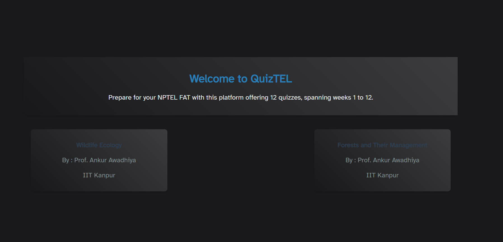
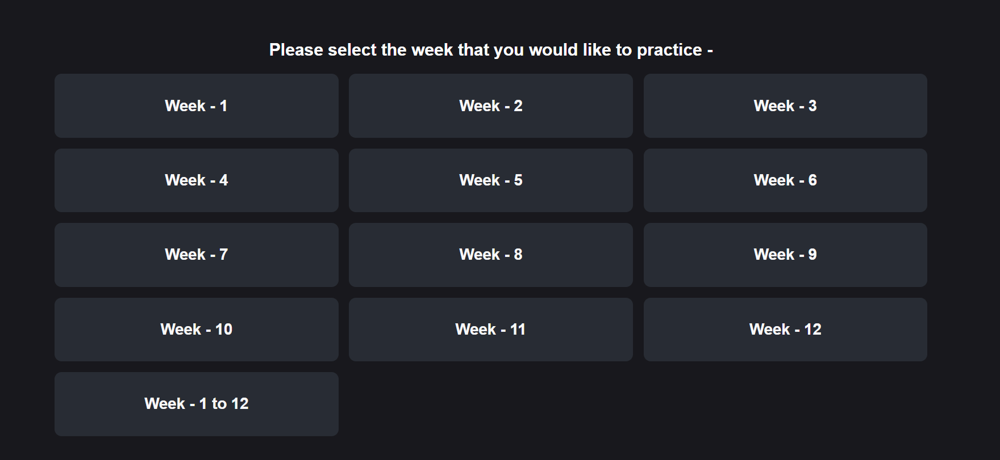
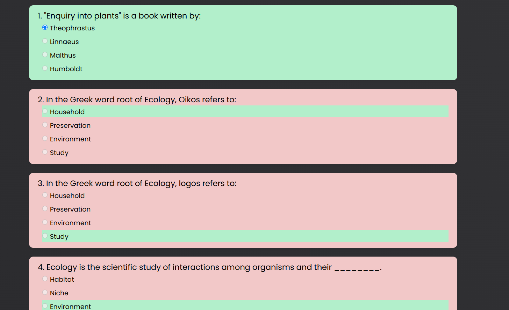

# QuizTEL

Welcome to **[QuizTEL](https://quiztel.vercel.app/)**, a web-based quiz platform designed to help users prepare for their **NPTEL FAT** (Final Assessment Test). The platform provides **12 quizzes**, covering **weeks 1 to 12** of the course.


## 📜 Features

- **Interactive Quiz Platform**:  This platform provides 12 quizzes, each containing 10 questions, covering weeks 1 to
12 of the course, along with a curated quiz for all weeks consisting of 120 questions.
- **Responsive Design**: Optimized for different screen sizes.

## 🎨 Technologies Used

- **HTML** - Structuring the content.
- **CSS** - Styling and layout.
- **JavaScript** - Tracking scores.

## 📌 Usage

1. Clone the repository:
   ```sh
   git clone https://github.com/your-repo/QuizTEL.git
2. Open index.html in a web browser.
3. Click on a course to start.


## 🖼️ Screenshots
<<<<<<< HEAD

=======

>>>>>>> a0aedeecc8a355901d978a9ee84bf6e7bc6b7a90





## 📖 Badges
[](https://choosealicense.com/licenses/mit/)
